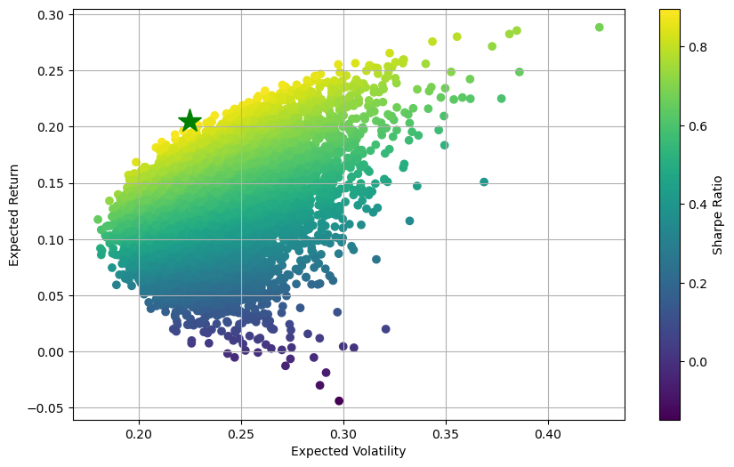

# QFin Projects

### Table of Contents
1. [Markowitz Portfolio](#markowitz)
2. [Natural Gas Futures Contract](#natgas)
3. [Probability of Default and FICO scores](#pd-fico)

## Markowitz Portfolio <a name="markowitz"></a>
- Modern portfolio theory assumes that investors can construct optimal portfolios offering the maximum possible expected return for a given level of risk. It is assumed that historical mean performance is the best estimator for future (expected) performance. The efficient portfolio is the portfolio that has 
    
    - highest reward for a given level of risk OR
    - lowest level of risk for a given return
- For this project (`03-markowitz_optimized.ipynb`), we pick 5 stocks (AAPL, WMT, TSLA, GE, AMZN, DB) and download their historical stock data (2012-2023) using `yfinance`. We collect the closing prices into a dataframe and calculate the log daily returns for each stock. 
- A given array of weights (summing to 1) determines a portfolio. We denote by $w_i$ the weight of the i-th stock, $r_i$ the return of the i-th stock and $\mu_i$ the expected return (mean). Then the **expected return of the portfolio** is given by
    ```math
        \begin{align*}
            \mu_{PF} = \mathbb E\left[\sum_i w_i r_i\right]& = \sum_i w_i \mathbb E(r_i)\\ &=\sum_i w_i\mu_i \\ &=\underline{w}^T\underline{\mu}
        \end{align*}
    ```

    The **expected portfolio variance** (risk) is given by
    ```math 
    \begin{align*}\sigma^2_{PF} = \mathbb{E}[(r_i-\mu_i)^2] &= \sum_i\sum_j w_i w_j \sigma_{ij}\\ &=\underline{w}^T\cdot M\cdot \underline{w},\end{align*}
    ```
    where $M$ is the covariance matrix (which contains the relationship between all the stocks in the portfolio) and $w_i$ are the weights as above. 

- To find the best portfolio, we follow a Monte-Carlo simulation approach. First, we generate several (10,000) random weights to get random portfolios. So, we define a `generate_portfolios` function that retruns an array of returns and variances for each portfolio. Using this, we generate an Efficient Frontier plot color-encoded on the Sharpe ratio (which is a measure of excess return (risk premium) per unit of standard deviation in an asset).

- Finally, to get the optimal portfolio with the highest Sharpe ratio (practically minimizing risk while maximizing expected returns), we first define a function called `statistics` which returns an array of portfolio return, volatility and the ratio return/volatility for a given set of weights and log daily returns. Then, we use `scipy.optimize` on the negative of the Sharpe ratio output of `statistics` (as the optimization package only finds minimum and we want a max). The function `optimize_portfolio` finally returns the optimum weights.  The star below denotes the optimal portfolio.

The output is `[0.332 0.322 0.178 0.    0.169 0.   ]`. So, based on the collected historical data, to achieve the best Sharpe ratio of 0.914, we should have 36% of stocks in AAPL, 32.2% in WMT, 17.8% in TSLA, 16.9% in AMZN, and none in GE and DB. But since the best Sharpe ratio is less 1, it is best to look for a different set of stocks. 

## Natural gas storage futures <a name="natgas"></a>
- Utilized ARIMA (while exploring the data in the draft notebook) and Holt-Winters in the predictive modeling to forecast the price of natural gas commodity on the provided historical data `01-nat_gas_historical_data.csv`
- In `01-natural_gas_futures_contract`, we develop a prototype pricing model for natural gas storage contracts. It takes blah blah

## Probability of Default and FICO scores <a name="pd-fico"></a>
- Provided a loan dataset (`02-loan_data.csv`), we analyze the book of loans to estimate customers' probability of default. A regression model ended up overfitting on the test dataset when applied to the validation dataset, even after adjusting number of iterations, and applying L1 and L2 lasso penalities. It turns out a Naive Bayseian (GaussianNB) is a better model here. We achieve a 95% etc.
- Next, in the FICO brackets notebook, we adjust [adapt the prompt]
- We end up deploying a log-likelihood optimization to strategically bucket customers with various FICO scores in order to narrow in on the probability of default


