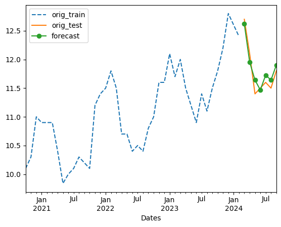

# QFin Projects

### Table of Contents
1. [Markowitz Portfolio](#markowitz)
2. [Natural Gas Futures Contract](#natgas)
3. [Probability of Default and FICO scores](#pd-fico)

## Markowitz Portfolio <a name="markowitz"></a>
Modern portfolio theory assumes that investors can construct optimal portfolios offering the maximum possible expected return for a given level of risk. It is assumed that historical mean performance is the best estimator for future (expected) performance. The efficient portfolio is the portfolio that has 

- highest reward for a given level of risk OR
- lowest level of risk for a given return.

For this project (`03-markowitz_optimized.ipynb`), we pick 5 stocks (AAPL, WMT, TSLA, GE, AMZN, DB) and download their historical stock data (2012-2023) using `yfinance`. We collect the closing prices into a dataframe and calculate the log daily returns for each stock. 

A given array of weights (summing to 1) determines a portfolio. We denote by $w_i$ the weight of the i-th stock, $r_i$ the return of the i-th stock and $\mu_i$ the expected return (mean). Then the **expected return of the portfolio** is given by

```math
    \begin{align*}
        \mu_{PF} = \mathbb E\left[\sum_i w_i r_i\right]& = \sum_i w_i \mathbb E(r_i)\\ &=\sum_i w_i\mu_i \\ &=\underline{w}^T\underline{\mu}
    \end{align*}
```

The **expected portfolio variance** (risk) is given by
    
```math 
\begin{align*}\sigma^2_{PF} = \mathbb{E}[(r_i-\mu_i)^2] &= \sum_i\sum_j w_i w_j \sigma_{ij}\\ &=\underline{w}^T\cdot M\cdot \underline{w},\end{align*}
```
where $M$ is the covariance matrix (which contains the relationship between all the stocks in the portfolio) and $w_i$ are the weights as above. 

To find the best portfolio, we follow a Monte-Carlo simulation approach. First, we generate several (10,000) random weights to get random portfolios. So, we define a `generate_portfolios` function that retruns an array of returns and variances for each portfolio. Using this, we generate an Efficient Frontier plot color-encoded on the Sharpe ratio (which is a measure of excess return (risk premium) per unit of standard deviation in an asset).

Finally, to get the optimal portfolio with the highest Sharpe ratio (practically minimizing risk while maximizing expected returns), we first define a function called `statistics` which returns an array of portfolio return, volatility and the ratio return/volatility for a given set of weights and log daily returns. Then, we use `scipy.optimize` on the negative of the Sharpe ratio output of `statistics` (as the optimization package only finds minimum and we want a max). The function `optimize_portfolio` finally returns the optimum weights.  The star below denotes the optimal portfolio.


The output is `[0.332 0.322 0.178 0.    0.169 0.   ]`. So, based on the collected historical data, to achieve the best Sharpe ratio of 0.914, we should have 36% of stocks in AAPL, 32.2% in WMT, 17.8% in TSLA, 16.9% in AMZN, and none in GE and DB. But since the best Sharpe ratio is less 1, it is best to look for a different set of stocks. 

## Natural gas storage futures <a name="natgas"></a>

This project is about commodity storage contracts. It was part of the [JPMorgan Chase & Co. Quantitative Research virtual "internship"](https://www.theforage.com/simulations/jpmorgan/quantitative-research-11oc). The ultimate goal was to prepare a prototype storage contract for natural gas. To price the contract, we are given historical (monthly) data (from JPM&C Forage). We use it to estimate the future gas price at any date. 

Before we make a forecasting model, time series analysis on the historical data is done in the [draft notebook](./01-draft-natural_gas_price_time_series_analysis_forecast.ipynb). From the time series plots, the data shows clear trend and seaonality, but we nonetheless check for stationarity of the data by performing an Augmented Dickey-Fuller test. We also check for autocorrelation and seasonality.  

In this [notebook](./01-natural_gas_price_modeling.ipynb), we do `seasonal_decompose` from the `statsmodel` package to conclude that our time series is **multiplicative** with trend and seasonality. So, we use **Holt-Winters Exponential Smoothing** for forecasting prices. We get an NRMSE of 0.0189. The notebook ends with a price forecast function. It uses interpolated  price forecast data to return the estimated price at any given date (in the past and up to 1 year in the future). 



Lastly, we devise a prototype contract pricing model in this [notebook](./01-natural_gas_futures_contract_prototype.ipynb). The input parameters involved were injection dates, withdrawal dates, prices on those dates, rate at which gas can be injected/withdrawn, maximum volume that can be stored, and storage costs. With certain assumptions (eg. no transport delay, and interest rates are zero) and the predicted prices from above, we write a function that takes these inputs and gives back the value of the contract. 

## Probability of Default and FICO scores <a name="pd-fico"></a>

The second part of the Forage project was to estimate the probability of default for a borrower given a loan dataset (`02-loan_data.csv`).

Looking at the histograms of the features, it appears that they follow a Gaussian (normal) distribution and we check if each feature, given a specific class of the target variable (default=0,1), follows a Gaussian distribution. As this turns out to be the case, we train a Gaussian Naive Bayes and we achieve a 97.8% accuracy on a test set.

Next, in the [FICO brackets notebook](./02-FICO_brackets_log_likelihood.ipynb), we give a detailed Python code to strategically bucket  customers with various FICO scores (i.e., apply **quantization**). Context: we are told that the hypothetical architecture we are working in requires categorical data. So, we need to create a rating map that maps the FICO score of the borrowers to a rating where a lower rating signifies a better credit score. We end up deploying a [log-likelihood](https://en.wikipedia.org/wiki/Likelihood_function) optimization. 

